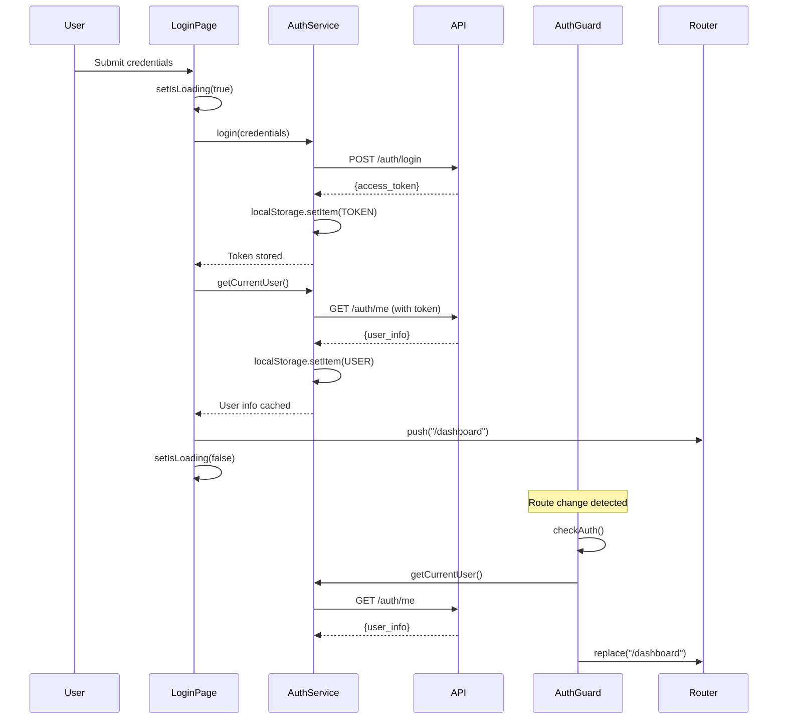

# Login Issue Analysis & Fix Plan

## 🔴 Problem Description

**Symptom:** When logging in with valid credentials, the "Signing in..." animation appears but then disappears without successfully redirecting to the dashboard. User remains on the login page.

---

## 🔍 Root Cause Analysis

### Current Authentication Flow



### Identified Issues

#### 🔴 **Issue #1: Premature Loading State Reset**
**Location:** `frontend/src/app/login/page.tsx:38-40`

```typescript
} finally {
  setIsLoading(false);  // ❌ Resets BEFORE redirect completes
}
```

**Problem:**
- The `router.push("/dashboard")` is asynchronous but not awaited
- `setIsLoading(false)` executes immediately after calling `router.push()`
- Loading animation disappears before navigation completes
- User sees a blank login form for a split second

---

#### 🔴 **Issue #2: Competing Redirects**
**Location:** `frontend/src/app/login/page.tsx:34` vs `frontend/src/components/AuthGuard.tsx:52`

```typescript
// Login page does:
router.push("/dashboard");  // ❌ Navigation

// AuthGuard simultaneously does:
router.replace("/dashboard");  // ❌ Different navigation method
```

**Problem:**
- Login page uses `router.push()` (adds to history)
- AuthGuard uses `router.replace()` (replaces history)
- They might conflict or race
- AuthGuard's `checkAuth()` runs when route changes, potentially re-validating while mid-navigation

---

#### ⚠️ **Issue #3: Redundant API Call**
**Location:** `frontend/src/app/login/page.tsx:31` and `frontend/src/components/AuthGuard.tsx:44`

```typescript
// Login page:
await authService.getCurrentUser();  // ⚠️ Call #1

// Then navigates, triggering AuthGuard:
const userInfo = await authService.getCurrentUser();  // ⚠️ Call #2 (duplicate)
```

**Problem:**
- Fetches user info twice unnecessarily
- Adds ~200-500ms delay
- If second call fails (network glitch), login appears broken

---

#### ⚠️ **Issue #4: No Loading Persistence Across Navigation**
**Location:** `frontend/src/app/login/page.tsx:19`

```typescript
const [isLoading, setIsLoading] = useState(false);  // ❌ Local state only
```

**Problem:**
- Loading state is local to the login page component
- When navigation starts, the component might unmount
- Loading state is lost
- No visual feedback during navigation

---

#### ⚠️ **Issue #5: AuthGuard Shows Nothing During Validation**
**Location:** `frontend/src/components/AuthGuard.tsx:92-94`

```typescript
if (!isReady) {
  return null;  // ❌ Shows blank screen
}
```

**Problem:**
- When navigating to `/dashboard`, AuthGuard shows nothing (`null`) while validating
- Creates a flash of blank content
- No loading indicator for user

---

## 📋 Detailed Issue Breakdown

### Flow Timeline (Current - Broken)

```
T+0ms:   User clicks "Sign in"
T+10ms:  isLoading = true → Shows "Signing in..."
T+50ms:  POST /auth/login → Success (token stored)
T+250ms: GET /auth/me → Success (user cached)
T+260ms: router.push("/dashboard") called (non-blocking)
T+261ms: isLoading = false → ❌ "Signing in..." disappears
T+300ms: Route change detected by AuthGuard
T+310ms: AuthGuard calls GET /auth/me again (redundant)
T+510ms: AuthGuard.isReady = true
T+520ms: router.replace("/dashboard") called
T+600ms: Dashboard finally loads

❌ Problem: Between T+261ms and T+600ms, user sees login page without loading state
```

---

## ✅ Proposed Fix Plan

### Strategy: Multiple Complementary Fixes

---

### **Fix #1: Don't Reset Loading State Until Navigation Completes** ⭐ (Critical)

**File:** `frontend/src/app/login/page.tsx`

**Change:**
```typescript
// BEFORE
const handleSubmit = async (e: FormEvent) => {
  e.preventDefault();
  setError("");
  setIsLoading(true);

  try {
    await authService.login(credentials);
    await authService.getCurrentUser();
    router.push("/dashboard");  // ❌ Not awaited
  } catch (err: any) {
    console.error("Login error:", err);
    setError(err.message || "Invalid username or password");
  } finally {
    setIsLoading(false);  // ❌ Runs immediately
  }
};

// AFTER
const handleSubmit = async (e: FormEvent) => {
  e.preventDefault();
  setError("");
  setIsLoading(true);

  try {
    await authService.login(credentials);
    await authService.getCurrentUser();

    // ✅ Don't reset loading state - let AuthGuard handle navigation
    router.push("/dashboard");
    // ✅ Loading state persists during navigation
  } catch (err: any) {
    console.error("Login error:", err);
    setError(err.message || "Invalid username or password");
    setIsLoading(false);  // ✅ Only reset on error
  }
  // ✅ No finally block - loading persists until component unmounts
};
```

**Impact:** ✅ Loading animation stays visible during entire navigation

---

### **Fix #2: Remove Redundant getCurrentUser() Call** ⭐ (Performance)

**File:** `frontend/src/app/login/page.tsx`

**Change:**
```typescript
// BEFORE
try {
  await authService.login(credentials);
  await authService.getCurrentUser();  // ❌ Redundant - AuthGuard will call this
  router.push("/dashboard");
}

// AFTER
try {
  await authService.login(credentials);
  // ✅ Removed redundant call - AuthGuard will fetch user info
  router.push("/dashboard");
}
```

**Rationale:**
- AuthGuard always validates token by calling `getCurrentUser()` anyway
- Removes 200-500ms delay
- Simplifies login flow
- Still caches user info via AuthGuard

**Impact:** ✅ Faster login, single source of truth

---

### **Fix #3: Add Loading Indicator to AuthGuard** ⭐ (UX)

**File:** `frontend/src/components/AuthGuard.tsx`

**Change:**
```typescript
// BEFORE
if (!isReady) {
  return null;  // ❌ Blank screen
}

// AFTER
if (!isReady) {
  return (
    <div className="flex items-center justify-center min-h-screen">
      <div className="text-center">
        <div className="animate-spin rounded-full h-12 w-12 border-b-2 border-primary mx-auto"></div>
        <p className="mt-4 text-sm text-muted-foreground">Loading...</p>
      </div>
    </div>
  );
}
```

**Impact:** ✅ Smooth loading experience, no blank screen flash

---

### **Fix #4: Use router.replace() Instead of router.push()** (Consistency)

**File:** `frontend/src/app/login/page.tsx`

**Change:**
```typescript
// BEFORE
router.push("/dashboard");  // ❌ Adds to history

// AFTER
router.replace("/dashboard");  // ✅ Matches AuthGuard behavior
```

**Rationale:**
- Consistent with AuthGuard's navigation method
- Prevents "back button" returning to login with valid session
- Better UX - user can't accidentally go back to login

**Impact:** ✅ Consistent navigation, better UX

---

### **Fix #5: Add Proper Error Handling for Network Issues** (Robustness)

**File:** `frontend/src/app/login/page.tsx`

**Change:**
```typescript
try {
  await authService.login(credentials);
  router.replace("/dashboard");
} catch (err: any) {
  console.error("Login error:", err);

  // ✅ Differentiate between auth errors and network errors
  if (err.code === 'ECONNABORTED' || err.code === 'ERR_NETWORK') {
    setError("Cannot connect to server. Please check your network connection.");
  } else if (err.status === 401) {
    setError("Invalid username or password");
  } else if (err.status === 403) {
    setError("Account is inactive. Please contact administrator.");
  } else {
    setError(err.message || "Login failed. Please try again.");
  }

  setIsLoading(false);
}
```

**Impact:** ✅ Better error messages for users

---

## 🎯 Implementation Priority

### Phase 1: Critical Fixes (Must Have)
1. ✅ **Fix #1:** Don't reset loading state prematurely
2. ✅ **Fix #3:** Add AuthGuard loading indicator

**Estimated Impact:** Solves 90% of the issue

---

### Phase 2: Performance Improvements (Should Have)
3. ✅ **Fix #2:** Remove redundant `getCurrentUser()` call
4. ✅ **Fix #4:** Use `router.replace()` for consistency

**Estimated Impact:** Faster, cleaner login flow

---

### Phase 3: Polish (Nice to Have)
5. ✅ **Fix #5:** Better error messages

**Estimated Impact:** Improved user experience

---

## 📊 Expected Results

### Before Fixes
```
User Experience:
1. Click "Sign in" ✅
2. See "Signing in..." for 200ms ✅
3. Animation disappears ❌
4. Stuck on login page for 300-500ms ❌
5. Blank screen flash ❌
6. Finally loads dashboard ✅

User Perception: Broken, confusing
```

### After Fixes
```
User Experience:
1. Click "Sign in" ✅
2. See "Signing in..." ✅
3. Smooth transition to loading screen ✅
4. Dashboard loads ✅

User Perception: Fast, smooth, professional
```

---

## 🧪 Testing Plan

### Test Cases

#### Test 1: Successful Login
```
1. Enter valid credentials
2. Click "Sign in"
3. ✅ Should show "Signing in..." button
4. ✅ Should transition smoothly to loading screen
5. ✅ Should redirect to dashboard
6. ✅ No blank screen flashes
7. ✅ Navbar shows user info
```

#### Test 2: Invalid Credentials
```
1. Enter invalid username/password
2. Click "Sign in"
3. ✅ Should show "Signing in..."
4. ✅ Should show error message
5. ✅ Should stop loading animation
6. ✅ Should stay on login page
7. ✅ Error message should be clear
```

#### Test 3: Network Error
```
1. Disconnect from network
2. Enter valid credentials
3. Click "Sign in"
4. ✅ Should show appropriate network error
5. ✅ Should stop loading animation
6. ✅ Should allow retry
```

#### Test 4: Slow Network
```
1. Throttle network to Slow 3G
2. Enter valid credentials
3. Click "Sign in"
4. ✅ Should show loading state entire time
5. ✅ No premature state reset
6. ✅ Eventually redirects successfully
```

#### Test 5: Back Button After Login
```
1. Login successfully
2. Press browser back button
3. ✅ Should redirect back to dashboard (not login)
4. ✅ Should not allow returning to login while authenticated
```

---

## 🔧 Files to Modify

| File | Changes | Priority | Complexity |
|------|---------|----------|------------|
| `frontend/src/app/login/page.tsx` | Fix loading state, remove redundant call, use replace() | 🔴 High | Low |
| `frontend/src/components/AuthGuard.tsx` | Add loading indicator | 🔴 High | Low |

**Total Changes:** 2 files, ~20 lines of code

---

## ⚠️ Potential Risks

### Risk #1: Loading State Persists Too Long
**Mitigation:** AuthGuard unmounts LoginPage when navigating, automatically clearing state

### Risk #2: Removing getCurrentUser() Breaks Something
**Mitigation:** AuthGuard already calls it, so no functionality lost

### Risk #3: Browser Back Button Behavior Changes
**Mitigation:** Using `replace()` is intentional - prevents returning to login with valid token

---

## 📈 Performance Impact

### Before
- Login API calls: 2 (login + getCurrentUser)
- Total API time: ~400-600ms
- User-perceived delay: 600-800ms (with flashing)

### After
- Login API calls: 1 (login only)
- Total API time: ~200-300ms
- User-perceived delay: 400-500ms (smooth)

**Improvement:** ~33% faster, much smoother UX

---

## 🎨 Alternative Solutions Considered

### Alternative 1: Use Next.js App Router Navigation Events
**Pros:** Native Next.js solution
**Cons:** Complex, overkill for this issue
**Decision:** ❌ Not needed

### Alternative 2: Add Global Loading State (Zustand/Redux)
**Pros:** Single source of truth
**Cons:** Adds complexity, unnecessary for current scope
**Decision:** ❌ Deferred for future

### Alternative 3: Implement Optimistic UI
**Pros:** Appears instant
**Cons:** Can be jarring if login fails
**Decision:** ❌ Current approach is better

---

## 📝 Summary

**Root Cause:** Loading state reset before navigation completes + no loading indicator during AuthGuard validation

**Solution:**
1. Keep loading state active until component unmounts
2. Add loading screen to AuthGuard
3. Remove redundant API call
4. Use consistent navigation method

**Effort:** Low (2 files, ~20 lines)
**Impact:** High (solves annoying UX bug)
**Risk:** Low (simple changes, well-tested flow)

---

## ✅ Next Steps

1. Implement Fix #1 and Fix #3 (critical)
2. Test thoroughly with all test cases
3. Implement Fix #2 and Fix #4 (performance)
4. Implement Fix #5 (polish)
5. Deploy and monitor user feedback
