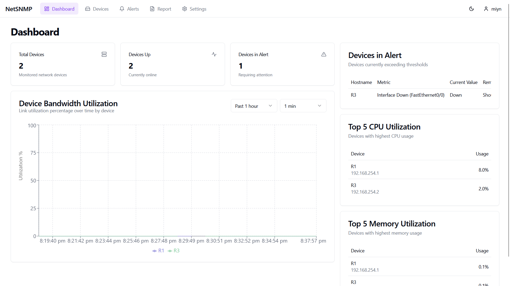
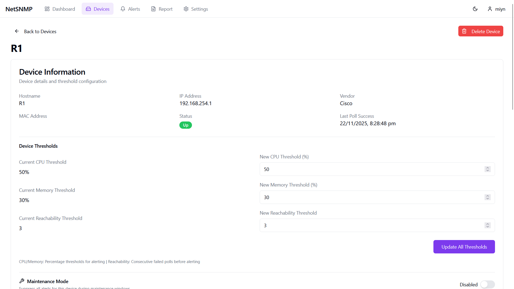
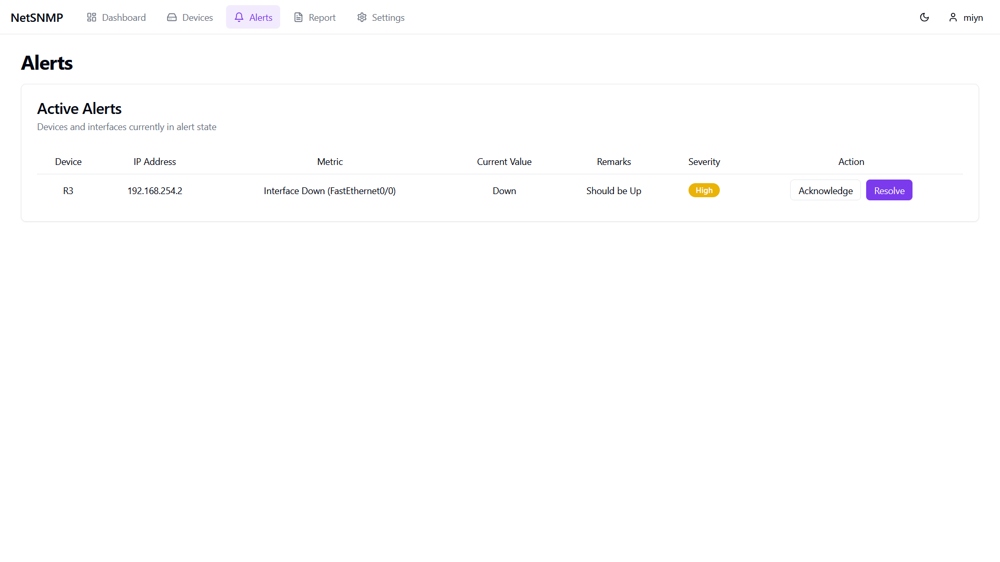
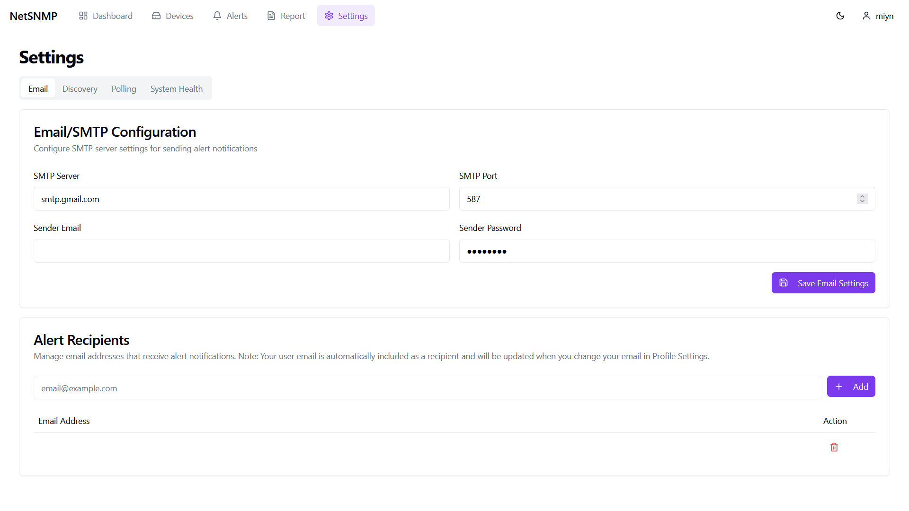
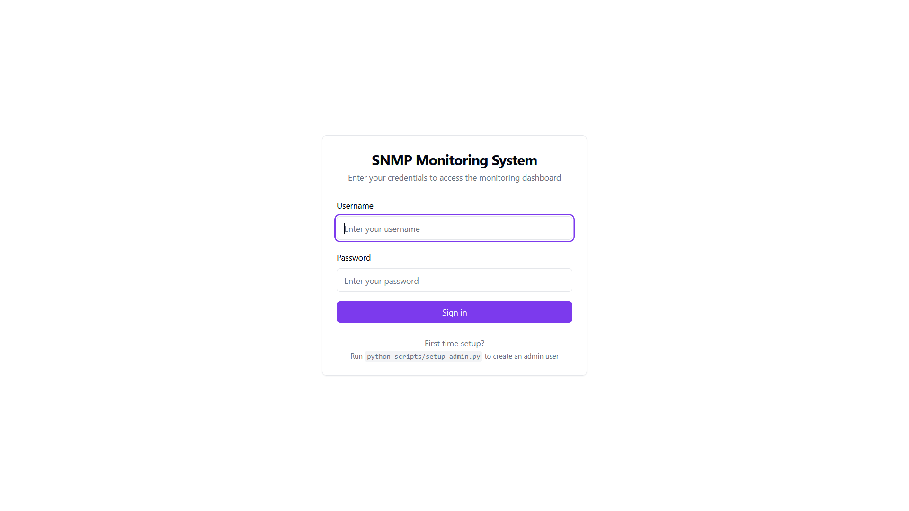

# SNMP Monitoring System

A comprehensive network monitoring solution built with FastAPI and Next.js that provides real-time SNMP device monitoring, alerting, and reporting capabilities.

## Features

### Core Monitoring
- **Automatic Device Discovery**: Scans network ranges to detect SNMP-enabled devices
- **Real-time Polling**: Continuous monitoring of device health and metrics
- **Multi-Metric Support**: Monitors CPU, memory, uptime, bandwidth, and custom OIDs
- **Alert Management**: Configurable thresholds with email notifications
- **Device Status Tracking**: Real-time reachability and performance monitoring

### User Interface
- **Interactive Dashboard**: Visual overview of network health with KPI cards
- **Device Details**: Comprehensive per-device metrics and historical data
- **Alert Console**: View, acknowledge, and manage network alerts
- **Reporting**: Generate network performance reports
- **Settings Management**: Configure alert recipients and thresholds

### Technical Highlights
- **Async Architecture**: Built on FastAPI for high-performance concurrent operations
- **Type Safety**: Full TypeScript frontend with React 18
- **Modern UI**: Responsive design with Tailwind CSS and shadcn/ui components
- **Real-time Updates**: TanStack Query for efficient data fetching
- **Background Services**: Automated discovery and polling processes

## Technology Stack

### Backend
- **Framework**: FastAPI (Python 3.12)
- **Database**: SQLite with SQLAlchemy ORM
- **Cache**: Redis (optional, for performance optimization)
- **SNMP Library**: pysnmp
- **Server**: Uvicorn (ASGI)

### Frontend
- **Framework**: Next.js 14 (App Router)
- **Language**: TypeScript 5
- **UI Library**: React 18
- **Styling**: Tailwind CSS + shadcn/ui
- **Data Fetching**: TanStack Query (React Query)
- **Charts**: Recharts

## Screenshots

### Dashboard
<!-- TODO: Add screenshot -->

*Real-time network monitoring dashboard with KPI cards, device status, and performance charts*

### Device Details
<!-- TODO: Add screenshot -->

*Comprehensive device metrics with historical data and threshold configuration*

### Alert Management
<!-- TODO: Add screenshot -->

*Active alerts console with acknowledge and resolve capabilities*

### Settings
<!-- TODO: Add screenshot -->

*Configure alert recipients, thresholds, and trigger network discovery*

### Login Page
<!-- TODO: Add screenshot -->

*Secure JWT-based authentication with modern, responsive design*

> **Note:** Replace placeholder images with actual screenshots by placing PNG files in `docs/images/` directory.

## Quick Start

### Prerequisites

- Python 3.12+
- Node.js 18+
- npm
- Git
- OpenSSL (for generating secure secrets)
- Redis (optional but recommended for caching)

#### Installing Python 3.12

If your system doesn't have Python 3.12+, install it first:

**Ubuntu/Debian:**
```bash
# Add deadsnakes PPA repository
sudo add-apt-repository ppa:deadsnakes/ppa
sudo apt update

# Install Python 3.12
sudo apt install python3.12 python3.12-venv python3.12-dev

# Verify installation
python3.12 --version
```

**macOS (with Homebrew):**
```bash
# Install Python 3.12
brew install python@3.12

# Verify installation
python3.12 --version
```

**Windows:**
Download Python 3.12+ from [python.org](https://www.python.org/downloads/) and run the installer.

**Alternative - Using pyenv:**
```bash
# Install pyenv (if not installed)
curl https://pyenv.run | bash

# Install Python 3.12
pyenv install 3.12
pyenv global 3.12
```

### Automated Setup (Recommended) 🚀

**One-command installation for both development and production:**

```bash
# Clone the repository
git clone https://github.com/wharizmarzuki/SNMP-Monitoring.git
cd SNMP-Monitoring

# Run interactive setup wizard
./setup.sh
```

The setup wizard will:
- ✅ Check system dependencies
- ✅ Prompt for all configuration (network range, SNMP settings, email, Redis, etc.)
- ✅ **Automatically install and start Redis** (if you choose to enable caching)
- ✅ Auto-generate secure JWT secret
- ✅ Create `.env` files automatically
- ✅ Install Python and Node.js dependencies
- ✅ Initialize database
- ✅ Create admin user with your credentials
- ✅ Optionally start services

**That's it!** The wizard handles everything interactively - no manual file editing or separate scripts required.

#### For Production Setup

```bash
./setup.sh --production
```

Uses production-specific defaults with stricter validation.

---

### Quick Commands (Using Makefile)

After setup, use these convenient commands:

```bash
make dev          # Start development servers
make stop         # Stop all services
make validate     # Validate configuration
make health       # Check system health
make test-email   # Send test email
make status       # Show service status
make help         # Show all available commands
```

---

### Manual Setup (Alternative)

If you prefer manual configuration:

**1. Check Dependencies**
```bash
./scripts/check-dependencies.sh
```

**2. Backend Setup**
```bash
cd backend

# Create virtual environment
python3 -m venv venv
source venv/bin/activate

# Install dependencies
pip install -r requirements.txt

# Configure environment
cp .env.example .env
# Edit .env with your settings
```

**3. Frontend Setup**
```bash
cd frontend

# Install dependencies
npm install --legacy-peer-deps

# Configure environment
cp .env.example .env.local
# Edit .env.local if needed
```

**4. Create Admin User**
```bash
cd backend
source venv/bin/activate
python ../scripts/setup_admin.py
```

**5. Start Services**
```bash
# From project root
./start-dev.sh
```

---

### Access the Application

Once running, access:
- **Frontend**: http://localhost:3000
- **Backend API**: http://localhost:8000
- **API Documentation**: http://localhost:8000/docs
- **Health Check**: http://localhost:8000/health

**Default admin login**: Use the credentials you provided during setup

---

### Validation & Testing

**Validate your setup:**
```bash
./scripts/validate-setup.sh
# or
make validate
```

**Test email configuration:**
```bash
python scripts/test-email.py
# or
make test-email
```

**Check system health:**
```bash
curl http://localhost:8000/health | python3 -m json.tool
# or
make health
```

## Configuration

### Automatic Configuration (Recommended)

The `./setup.sh` wizard configures everything interactively. No manual editing required!

### Manual Configuration (If Needed)

If you need to modify settings later, edit `backend/.env`:

```bash
# Network Discovery
DISCOVERY_NETWORK=192.168.1.0/24    # Network range for device discovery (CIDR)

# SNMP Settings
SNMP_COMMUNITY=public               # SNMP community string
SNMP_TIMEOUT=10                     # Connection timeout
SNMP_RETRIES=3                      # Retry attempts

# Database
DATABASE_URL=sqlite:///./monitoring.db

# Monitoring
POLLING_INTERVAL=60                 # Seconds between polls
DISCOVERY_CONCURRENCY=20            # Concurrent discovery threads
POLLING_CONCURRENCY=20              # Concurrent polling threads

# Email Alerts
SMTP_SERVER=smtp.gmail.com
SMTP_PORT=587
SENDER_EMAIL=your@email.com
SENDER_PASSWORD=your-app-password   # Use Gmail App Password

# Security / JWT
JWT_SECRET_KEY=<auto-generated>     # Auto-generated by setup.sh
JWT_ALGORITHM=HS256
JWT_ACCESS_TOKEN_EXPIRE_HOURS=24

# Redis Cache (Optional)
CACHE_ENABLED=true                  # Enable/disable caching
REDIS_HOST=localhost                # Redis server hostname
REDIS_PORT=6379                     # Redis server port
REDIS_DB=0                          # Redis database number (0-15)

# Frontend URL
FRONTEND_URL=http://localhost:3000  # Or production domain

# Application
LOG_LEVEL=INFO
ENVIRONMENT=development
DEBUG=false
```

### Frontend Environment Variables

Edit `frontend/.env.local` (auto-created by setup.sh):

```bash
NEXT_PUBLIC_API_URL=http://localhost:8000  # Backend API URL
```

### Gmail App Password Setup

For email alerts to work with Gmail:
1. Go to https://myaccount.google.com/apppasswords
2. Generate an app password for "Mail"
3. Use this password in `SENDER_PASSWORD` (not your regular Gmail password)

The `./setup.sh` wizard provides guidance for this during setup.

## Project Structure

```
snmp-monitoring/
├── backend/                    # FastAPI backend
│   ├── app/
│   │   ├── api/               # API routes and middleware
│   │   ├── config/            # Configuration and settings
│   │   └── core/              # Database models and schemas
│   ├── services/              # Business logic services
│   │   ├── snmp_service.py
│   │   ├── device_service.py
│   │   ├── discovery_service.py
│   │   ├── polling_service.py
│   │   ├── alert_service.py
│   │   └── email_service.py
│   ├── main.py                # Application entry point
│   ├── requirements.txt
│   └── .env.example
│
├── frontend/                   # Next.js frontend
│   ├── src/
│   │   ├── app/               # Next.js App Router pages
│   │   ├── components/        # React components
│   │   ├── lib/               # Utilities and API client
│   │   └── types/             # TypeScript type definitions
│   ├── public/
│   ├── package.json
│   └── .env.example
│
├── logs/                       # Application logs
├── start-dev.sh               # Development startup script
├── stop-dev.sh                # Stop services script
├── ecosystem.config.js        # PM2 deployment config
├── DEPLOYMENT.md              # Deployment guide
└── README.md
```

## Deployment

For production deployment, see [DEPLOYMENT.md](DEPLOYMENT.md) for detailed instructions on:
- PM2 process management
- Nginx reverse proxy setup
- SSL/HTTPS configuration
- Performance tuning
- Monitoring and maintenance

Quick production start with PM2:
```bash
# Install PM2
npm install -g pm2

# Build frontend
cd frontend && npm run build && cd ..

# Start services
pm2 start ecosystem.config.js

# Monitor
pm2 monit
```

## API Documentation

Interactive API documentation is available at:
- Swagger UI: http://localhost:8000/docs
- ReDoc: http://localhost:8000/redoc

## Features in Detail

### Device Discovery
- Automated network scanning on configurable CIDR ranges
- SNMP v2c protocol support
- Concurrent scanning for faster discovery
- Automatic database updates

### Monitoring & Alerts
- Configurable polling intervals
- Custom OID support
- Threshold-based alerting
- Email notifications
- Alert acknowledgment and maintenance mode

### Reporting
- Historical data tracking
- Performance metrics visualization
- Export capabilities

## Development

### Backend Development
```bash
cd backend
source venv/bin/activate

# Run with auto-reload
uvicorn main:app --reload

# Run tests (if available)
pytest
```

### Frontend Development
```bash
cd frontend

# Development server
npm run dev

# Type checking
npm run build

# Linting
npm run lint
```

## Troubleshooting

### Port Already in Use
```bash
# Find and kill process on port 8000
lsof -i :8000
kill -9 $(lsof -t -i:8000)

# Find and kill process on port 3000
lsof -i :3000
kill -9 $(lsof -t -i:3000)
```

### Database Issues
```bash
# Reset database (WARNING: deletes all data)
rm backend/monitoring.db
# Will be recreated on next backend startup
```

### SNMP Connection Issues
- Verify SNMP community string matches device configuration
- Ensure devices have SNMP enabled
- Check firewall rules allow UDP port 161
- Verify network connectivity to target devices

### Redis Cache Issues
```bash
# Check if Redis is running
redis-cli ping

# Start Redis (if installed but not running)
sudo systemctl start redis

# Check Redis logs
sudo journalctl -u redis -f

# Disable caching if Redis unavailable
# In backend/.env, set: CACHE_ENABLED=false
```

## Contributing

1. Fork the repository
2. Create a feature branch
3. Make your changes
4. Submit a pull request

## License

[Specify your license here]

## Support

For issues, questions, or contributions, please open an issue on GitHub.

## Acknowledgments

Built with modern web technologies:
- FastAPI for the backend API
- Next.js for the frontend framework
- shadcn/ui for beautiful UI components
- pysnmp for SNMP protocol implementation
