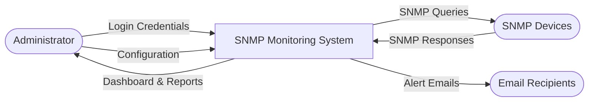
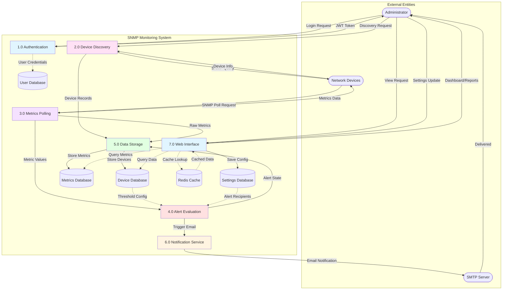
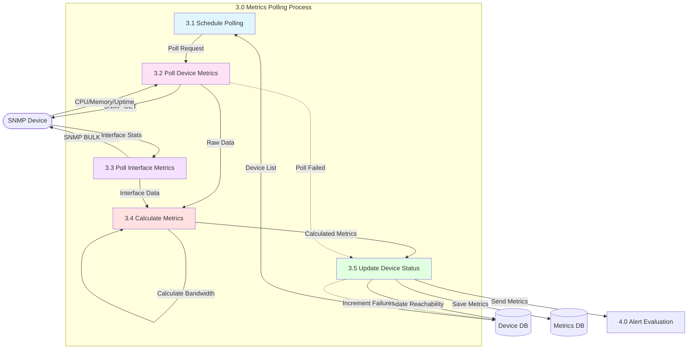

# Data Flow Diagram (DFD)

This diagram illustrates how data flows through the SNMP Monitoring System.

## Level 0 - Context Diagram

## Level 1 - Main Processes

## Level 2 - Metrics Polling Process (Detailed)

## Data Stores

### D1 - User Database
- **Stores**: User accounts, credentials, roles
- **Used by**: Authentication process
- **Format**: SQLite table (users)

### D2 - Device Database
- **Stores**: Device information, IP addresses, hostnames, thresholds, alert states
- **Used by**: All processes
- **Format**: SQLite tables (devices, interfaces)

### D3 - Metrics Database
- **Stores**: Historical metrics data (CPU, memory, interface stats)
- **Used by**: Polling, reporting, alerting
- **Format**: SQLite tables (device_metrics, interface_metrics)

### D4 - Settings Database
- **Stores**: Application settings, SNMP config, SMTP config, alert recipients
- **Used by**: All processes for configuration
- **Format**: SQLite tables (application_settings, alert_recipients)

### Redis Cache
- **Stores**: Temporary cached data for performance
- **Used by**: Web interface
- **Format**: Key-value pairs with TTL

## Data Flow Descriptions

### 1. Authentication Flow
1. Admin submits login credentials
2. System validates against user database
3. JWT token issued for authenticated session

### 2. Discovery Flow
1. Admin triggers network discovery
2. System scans network range via SNMP
3. Discovered devices stored in database
4. Device information updated/created

### 3. Polling Flow
1. Background scheduler triggers polling
2. System queries devices via SNMP
3. Raw metrics collected and calculated
4. Metrics stored in database
5. Alert evaluation triggered

### 4. Alert Flow
1. Metrics compared against thresholds
2. Alert state transitions evaluated
3. Email notifications triggered
4. Alert recipients fetched from database
5. SMTP service sends notifications

### 5. Dashboard Flow
1. Admin requests dashboard view
2. System queries device and metrics databases
3. Cache checked for recent data
4. Data aggregated and formatted
5. Dashboard rendered to admin
