# Database Design

This document describes the database schema for the SNMP Monitoring System using Entity Relationship Diagrams (ERD).

## Entity Relationship Diagram

```mermaid
erDiagram
    Device ||--o{ DeviceMetric : "has"
    Device ||--o{ Interface : "has"
    Interface ||--o{ InterfaceMetric : "has"

    Device {
        int id PK
        string ip_address UK "Unique"
        string hostname UK "Unique"
        string mac_address
        string vendor
        int priority
        float cpu_threshold "Default: 80.0"
        float memory_threshold "Default: 80.0"
        int failure_threshold "Default: 3"
        string cpu_alert_state "clear|triggered|acknowledged"
        datetime cpu_acknowledged_at
        string memory_alert_state "clear|triggered|acknowledged"
        datetime memory_acknowledged_at
        string reachability_alert_state "clear|triggered|acknowledged"
        datetime reachability_acknowledged_at
        boolean cpu_alert_sent "Legacy"
        boolean memory_alert_sent "Legacy"
        boolean reachability_alert_sent "Legacy"
        boolean maintenance_mode "Default: false"
        datetime maintenance_until
        string maintenance_reason
        datetime last_poll_attempt
        datetime last_poll_success
        int consecutive_failures "Default: 0"
        boolean is_reachable "Default: true"
    }

    DeviceMetric {
        int id PK
        int device_id FK
        datetime timestamp "Default: now()"
        float cpu_utilization
        float memory_utilization
        bigint uptime_seconds
    }

    Interface {
        int id PK
        int device_id FK
        int if_index
        string if_name
        bigint speed_bps "Bits per second"
        string speed_source "ifSpeed|ifHighSpeed"
        datetime speed_last_updated
        float packet_drop_threshold "Default: 0.1%"
        string oper_status_alert_state "clear|triggered|acknowledged"
        datetime oper_status_acknowledged_at
        string packet_drop_alert_state "clear|triggered|acknowledged"
        datetime packet_drop_acknowledged_at
        boolean packet_drop_alert_sent "Legacy"
        boolean oper_status_alert_sent "Legacy"
    }

    InterfaceMetric {
        int id PK
        int interface_id FK
        datetime timestamp "Default: now()"
        int admin_status "1=up, 2=down, 3=testing"
        int oper_status "1=up, 2=down, 3=testing"
        float octets_in "Bytes received"
        float octets_out "Bytes transmitted"
        float errors_in
        float errors_out
        float discards_in
        float discards_out
    }

    User {
        int id PK
        string username UK "Unique"
        string email UK "Unique"
        string hashed_password
        boolean is_active "Default: true"
        boolean is_admin "Default: false"
        datetime created_at "Default: now()"
    }

    AlertRecipient {
        int id PK
        string email UK "Unique"
    }

    ApplicationSettings {
        int id PK
        string snmp_community "Default: public"
        int snmp_timeout "Default: 10"
        int snmp_retries "Default: 3"
        int polling_interval "Default: 60"
        int discovery_concurrency "Default: 20"
        int polling_concurrency "Default: 20"
        string smtp_server "Default: smtp.gmail.com"
        int smtp_port "Default: 587"
        string sender_email
        string sender_password
        string discovery_network "CIDR notation"
        datetime updated_at
    }
```



## Database Schema Details

### Core Tables

#### devices
Stores information about monitored network devices.

**Key Fields:**
- `id`: Primary key
- `ip_address`: Unique device IP (indexed)
- `hostname`: Unique device hostname
- `vendor`: Device manufacturer (e.g., "Cisco", "Juniper")
- `*_threshold`: Configurable alert thresholds per device
- `*_alert_state`: Current alert state (Phase 2 implementation)
- `maintenance_mode`: Suppresses alerts during maintenance
- `is_reachable`: Current reachability status
- `consecutive_failures`: Tracks sequential poll failures

**Relationships:**
- One-to-Many with `device_metrics`
- One-to-Many with `interfaces`

#### device_metrics
Stores historical metrics for each device poll.

**Key Fields:**
- `device_id`: Foreign key to devices
- `timestamp`: When metric was collected
- `cpu_utilization`: CPU usage percentage (0-100)
- `memory_utilization`: Memory usage percentage (0-100)
- `uptime_seconds`: Device uptime in seconds

**Purpose:** Historical trending, reporting, dashboard charts

#### interfaces
Stores network interface information for each device.

**Key Fields:**
- `device_id`: Foreign key to devices
- `if_index`: SNMP interface index
- `if_name`: Interface description (e.g., "GigabitEthernet0/1")
- `speed_bps`: Interface speed in bits per second
- `speed_source`: Which SNMP OID provided the speed
- `packet_drop_threshold`: Configurable discard percentage threshold
- `*_alert_state`: Current alert state for interface issues

**Relationships:**
- Many-to-One with `devices`
- One-to-Many with `interface_metrics`

#### interface_metrics
Stores historical interface statistics for each poll.

**Key Fields:**
- `interface_id`: Foreign key to interfaces
- `timestamp`: When metric was collected
- `admin_status`, `oper_status`: Interface administrative and operational states
- `octets_in/out`: Traffic counters in bytes
- `errors_in/out`: Error counters
- `discards_in/out`: Packet drop counters

**Purpose:** Bandwidth monitoring, packet drop detection, interface status tracking

### Configuration Tables

#### users
Authentication and user management.

**Key Fields:**
- `username`: Unique username for login
- `email`: User email address
- `hashed_password`: bcrypt password hash
- `is_active`: Account status
- `is_admin`: Admin privileges

**Security:** Passwords stored as bcrypt hashes, never plaintext

#### alert_recipients
Email addresses for alert notifications.

**Key Fields:**
- `email`: Unique email address

**Purpose:** Alert distribution list. Multiple recipients receive all alerts.

#### application_settings
System-wide configuration (singleton table).

**Key Fields:**
- SNMP configuration (community, timeout, retries)
- Polling configuration (interval, concurrency)
- Email/SMTP settings
- Network discovery range

**Note:** Only one row exists. Settings can be updated via API.

## Data Relationships

### Device Hierarchy
```
Device (1)
├── DeviceMetric (N) - Time series metrics
└── Interface (N)
    └── InterfaceMetric (N) - Time series metrics
```

### Alert State Management

The system uses a three-state model for alerts:

1. **clear**: No alert condition exists
2. **triggered**: Alert condition exists, notification sent
3. **acknowledged**: User acknowledged the alert, suppresses re-notifications

State transitions:
```
clear → triggered (threshold exceeded, send alert)
triggered → acknowledged (user acknowledges)
triggered → clear (value returns to normal, send recovery)
acknowledged → clear (value returns to normal, send recovery)
```

## Indexing Strategy

### Primary Indexes
- All `id` fields (primary keys)
- `devices.ip_address` (unique)
- `devices.hostname` (unique)
- `devices.mac_address`
- `interfaces.if_index`
- `interfaces.if_name`
- `users.username` (unique)
- `users.email` (unique)
- `alert_recipients.email` (unique)

### Performance Considerations

**Time-series Data:**
- `device_metrics` and `interface_metrics` grow continuously
- Consider implementing data retention policies (e.g., keep 30 days)
- Indexes on `timestamp` for efficient range queries

**Foreign Keys:**
- All FK relationships enforce referential integrity
- Cascade deletes configured for device deletion (removes metrics)

## SNMP OID Mappings

### Device OIDs (Standard)
```python
DEVICE_OIDS = {
    "uptime": "1.3.6.1.2.1.1.3.0",        # sysUpTime
    "hostname": "1.3.6.1.2.1.1.5.0",      # sysName
    "description": "1.3.6.1.2.1.1.1.0"   # sysDescr
}
```

### Interface OIDs (IF-MIB)
```python
INTERFACE_OIDS = {
    "interface_description": "1.3.6.1.2.1.2.2.1.2",     # ifDescr
    "interface_admin_status": "1.3.6.1.2.1.2.2.1.7",    # ifAdminStatus
    "interface_operational_status": "1.3.6.1.2.1.2.2.1.8", # ifOperStatus
    "interface_speed": "1.3.6.1.2.1.2.2.1.5",           # ifSpeed
    "inbound_octets": "1.3.6.1.2.1.2.2.1.10",          # ifInOctets
    "outbound_octets": "1.3.6.1.2.1.2.2.1.16",         # ifOutOctets
    "inbound_errors": "1.3.6.1.2.1.2.2.1.14",          # ifInErrors
    "outbound_errors": "1.3.6.1.2.1.2.2.1.20",         # ifOutErrors
    "inbound_discards": "1.3.6.1.2.1.2.2.1.13",        # ifInDiscards
    "outbound_discards": "1.3.6.1.2.1.2.2.1.19"        # ifOutDiscards
}
```

### Vendor-Specific OIDs (Cisco)
```python
VENDOR_OIDS = {
    "Cisco": {
        "cpu_utilization": "1.3.6.1.4.1.9.9.109.1.1.1.1.5",  # cpmCPUTotal5min
        "memory_pool_1": "1.3.6.1.4.1.9.9.48.1.1.1.5.1",     # ciscoMemoryPoolFree
        "memory_pool_2": "1.3.6.1.4.1.9.9.48.1.1.1.5.2",
        "memory_pool_13": "1.3.6.1.4.1.9.9.48.1.1.1.6.1"     # ciscoMemoryPoolUsed
    }
}
```

## Sample Queries

### Get Recent Device Metrics
```sql
SELECT
    d.hostname,
    dm.timestamp,
    dm.cpu_utilization,
    dm.memory_utilization
FROM devices d
JOIN device_metrics dm ON d.id = dm.device_id
WHERE d.id = ?
ORDER BY dm.timestamp DESC
LIMIT 100;
```

### Get Active Alerts
```sql
SELECT
    hostname,
    ip_address,
    cpu_alert_state,
    memory_alert_state,
    reachability_alert_state
FROM devices
WHERE
    cpu_alert_state != 'clear' OR
    memory_alert_state != 'clear' OR
    reachability_alert_state != 'clear';
```

### Get Interface Statistics
```sql
SELECT
    i.if_name,
    im.timestamp,
    im.oper_status,
    im.octets_in,
    im.octets_out,
    im.discards_in,
    im.discards_out
FROM interfaces i
JOIN interface_metrics im ON i.id = im.interface_id
WHERE i.device_id = ?
ORDER BY i.if_index, im.timestamp DESC;
```

## Database Technology

**Type:** SQLite
**ORM:** SQLAlchemy
**Migration:** Alembic (optional)

**Advantages:**
- Zero configuration
- Serverless (embedded)
- ACID compliant
- Sufficient for small-to-medium deployments

**Scalability Notes:**
For large deployments (>1000 devices), consider migrating to PostgreSQL:
- Better concurrent write performance
- Advanced indexing options
- Better handling of large datasets
