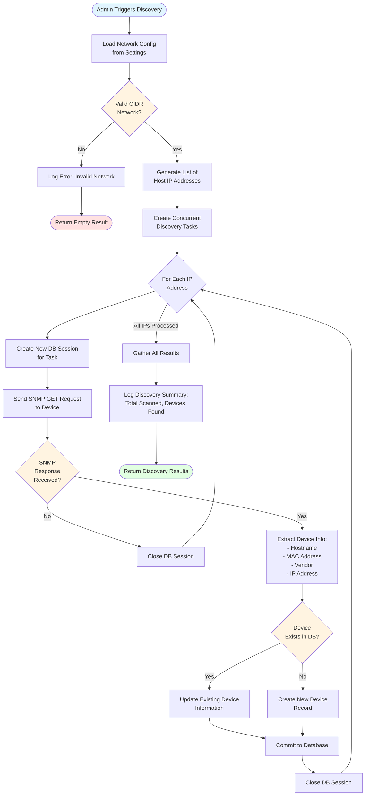
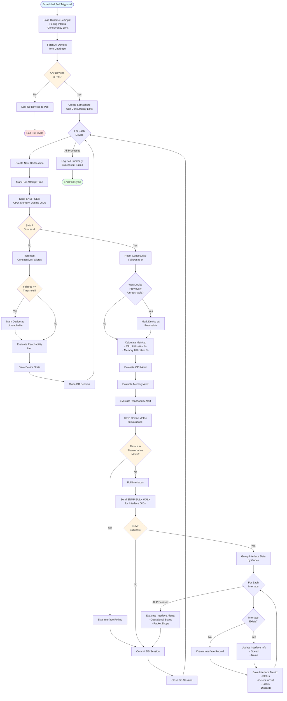
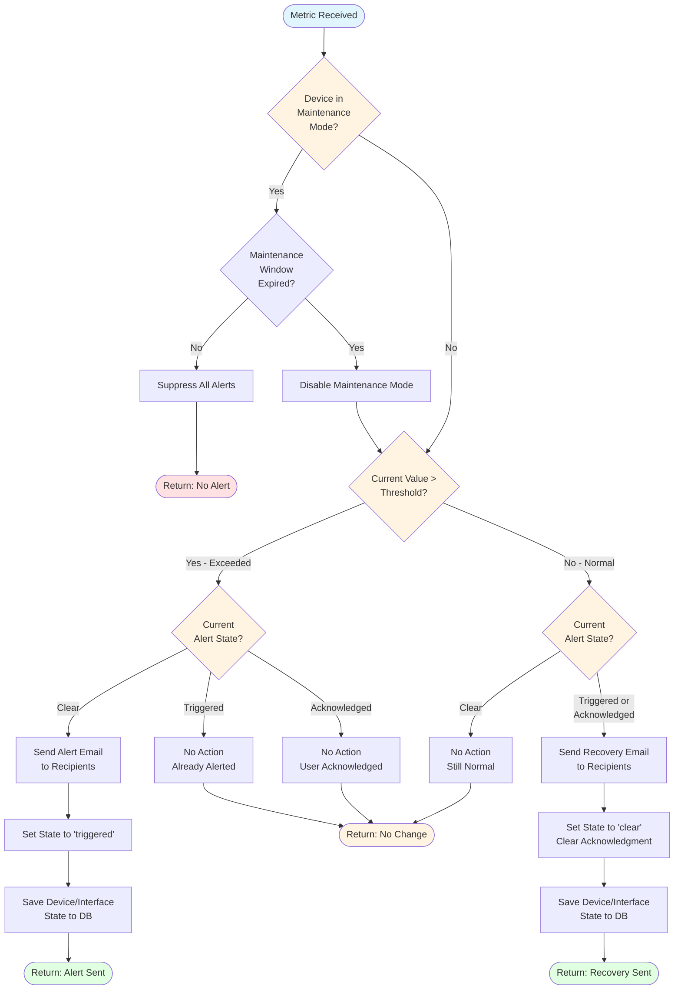
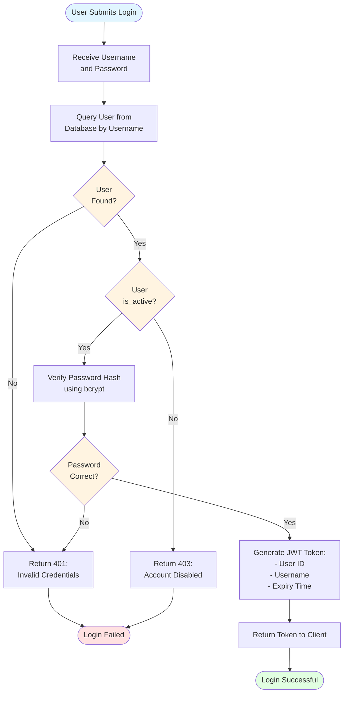
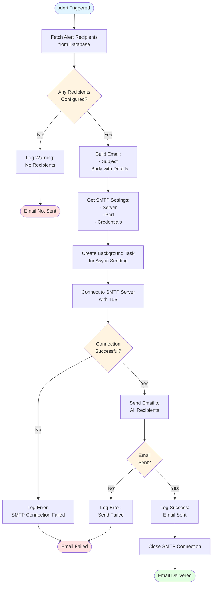

# System Flow Charts

This document contains detailed flowcharts for the main processes in the SNMP Monitoring System.

## 1. Device Discovery Process

## 2. Device Polling Process

## 3. Alert Evaluation Process

## 4. User Authentication Flow

## 5. Email Notification Process

## Process Timing

| Process | Frequency | Concurrency Limit |
|---------|-----------|-------------------|
| Device Discovery | On-Demand | Configurable (default: 20) |
| Device Polling | Every 60 seconds (configurable) | Configurable (default: 20) |
| Alert Evaluation | Per Poll | N/A (inline) |
| Email Notifications | On Alert Trigger | Background Tasks |

## Error Handling

All processes implement comprehensive error handling:

1. **Database Session Management**: Each concurrent task gets its own session
2. **Rollback on Failure**: Failed transactions are rolled back
3. **Logging**: All errors logged with context
4. **Graceful Degradation**: System continues operating even if individual devices fail
5. **Retry Logic**: SNMP queries have configurable timeout and retries
