# Use Case Diagram

This diagram shows the actors and use cases in the SNMP Monitoring System.

```mermaid
graph TB
    subgraph "SNMP Monitoring System"
        subgraph "Device Management"
            UC1[Discover Network Devices]
            UC2[View Device List]
            UC3[View Device Details]
            UC4[Configure Device Thresholds]
            UC5[Enable Maintenance Mode]
        end

        subgraph "Monitoring & Polling"
            UC6[Poll Device Metrics]
            UC7[Poll Interface Metrics]
            UC8[Monitor CPU/Memory]
            UC9[Monitor Interface Status]
            UC10[Track Device Reachability]
        end

        subgraph "Alert Management"
            UC11[Configure Alert Thresholds]
            UC12[Manage Alert Recipients]
            UC13[Acknowledge Alerts]
            UC14[View Active Alerts]
            UC15[Receive Email Notifications]
        end

        subgraph "User Management"
            UC16[Login to System]
            UC17[Manage User Accounts]
            UC18[Configure Settings]
        end

        subgraph "Reporting"
            UC19[View Dashboard]
            UC20[Generate Reports]
            UC21[View Historical Data]
        end
    end

    Admin([Administrator])
    System([Background Services])
    Email([Email Service])
    Device([SNMP Device])

    Admin --> UC1
    Admin --> UC2
    Admin --> UC3
    Admin --> UC4
    Admin --> UC5
    Admin --> UC11
    Admin --> UC12
    Admin --> UC13
    Admin --> UC14
    Admin --> UC16
    Admin --> UC17
    Admin --> UC18
    Admin --> UC19
    Admin --> UC20
    Admin --> UC21

    System --> UC1
    System --> UC6
    System --> UC7
    System --> UC8
    System --> UC9
    System --> UC10

    UC6 --> Device
    UC7 --> Device
    UC1 --> Device

    UC8 -.-> UC15
    UC9 -.-> UC15
    UC10 -.-> UC15

    UC15 --> Email

    style Admin fill:#e1f5ff
    style System fill:#fff4e1
    style Email fill:#ffe1e1
    style Device fill:#e1ffe1
```

## Actor Descriptions

### Administrator
The primary user who manages the monitoring system:
- Configures devices and thresholds
- Manages alerts and recipients
- Views dashboards and reports
- Manages user accounts and settings

### Background Services
Automated system processes that run continuously:
- Device discovery service
- Polling service for metrics collection
- Alert evaluation service

### Email Service
External SMTP service that:
- Delivers alert notifications
- Sends recovery notifications

### SNMP Device
Network devices being monitored:
- Respond to SNMP queries
- Provide metrics (CPU, memory, interface stats)

## Key Use Cases

### Device Discovery (UC1)
Scans network ranges to detect SNMP-enabled devices and adds them to the monitoring database.

### Poll Device Metrics (UC6)
Continuously queries devices for CPU, memory, and uptime metrics at configured intervals.

### Configure Alert Thresholds (UC11)
Allows administrators to set custom thresholds for CPU, memory, and interface metrics.

### Acknowledge Alerts (UC13)
Provides a mechanism to acknowledge alerts to prevent notification spam while issues are being resolved.

### Enable Maintenance Mode (UC5)
Temporarily suppresses alerts for devices undergoing planned maintenance.
