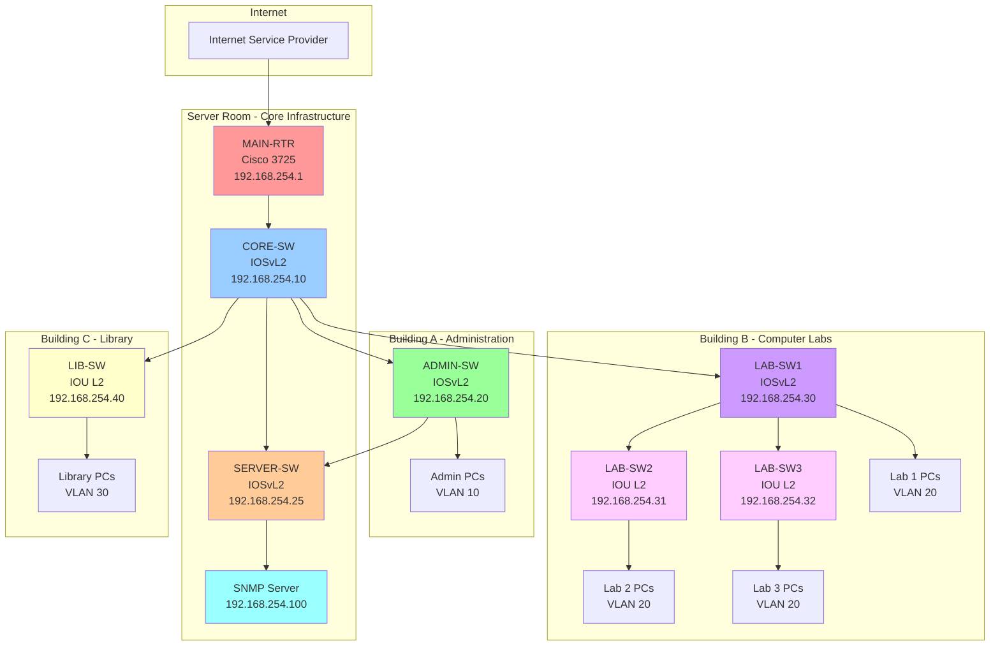
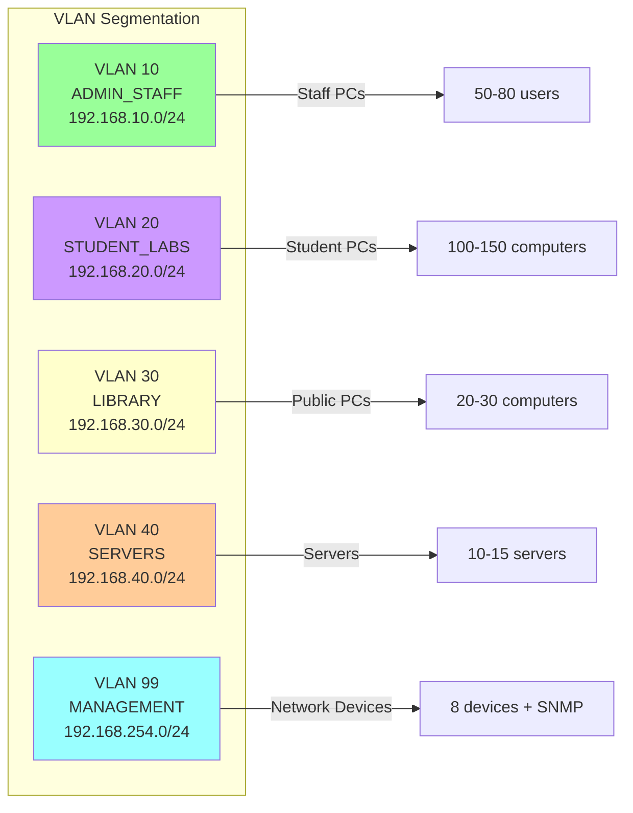

# GNS3 Network Simulation - Small Educational Institution

## 📋 Overview

This simulation replicates a **small educational institution network** with a **$20,000 budget** using GNS3. The topology includes 8 network devices monitored by an SNMP monitoring system.

### Institution Profile
- **Type:** Small vocational school / community college
- **Size:** 150-300 users (students + staff)
- **Buildings:** 3 (Administration, Computer Labs, Library)
- **Budget:** $20,000 total network infrastructure
- **Devices:** 8 monitored network devices

---

## 🌐 Network Topology



---

## 📊 Device Inventory

| # | Hostname | GNS3 Model | Real Device | IP Address | VLAN | Priority | Location |
|---|----------|------------|-------------|------------|------|----------|----------|
| 1 | MAIN-RTR | Cisco 3725 | ISR 1111 | 192.168.254.1 | 99 | Critical (1) | Server Room |
| 2 | CORE-SW | Cisco IOSvL2 | Catalyst 2960X | 192.168.254.10 | 99 | Critical (1) | Server Room |
| 3 | ADMIN-SW | Cisco IOSvL2 | Catalyst 2960 | 192.168.254.20 | 99 | High (2) | Building A |
| 4 | SERVER-SW | Cisco IOSvL2 | Catalyst 2960 | 192.168.254.25 | 99 | Critical (1) | Server Room |
| 5 | LAB-SW1 | Cisco IOSvL2 | Catalyst 2960 | 192.168.254.30 | 99 | High (2) | Building B |
| 6 | LAB-SW2 | Cisco IOU L2 | Catalyst 2950 | 192.168.254.31 | 99 | Medium (3) | Building B |
| 7 | LAB-SW3 | Cisco IOU L2 | Catalyst 2950 | 192.168.254.32 | 99 | Medium (3) | Building B |
| 8 | LIB-SW | Cisco IOU L2 | Catalyst 2950 | 192.168.254.40 | 99 | Medium (3) | Building C |

**Total: 8 network devices** (displays Top 5 on dashboard, 3 excluded)

---

## 🏗️ VLAN Design



---

## 💰 Budget Breakdown

| Item | Quantity | Unit Price | Total |
|------|----------|------------|-------|
| Cisco ISR 1111 Router (or refurb 2911) | 1 | $1,500 | $1,500 |
| Catalyst 2960X-48TS Core Switch | 1 | $3,000 | $3,000 |
| Catalyst 2960-24TC Switches | 3 | $2,500 | $7,500 |
| Catalyst 2950-24 Switches (refurbished) | 3 | $800 | $2,400 |
| **Hardware Subtotal** | | | **$14,400** |
| Cables, Patch Panels, Rack | - | - | $800 |
| SmartNet Support (1 year) | - | - | $2,000 |
| UPS & Power Distribution | - | - | $1,500 |
| Shipping & Tax | - | - | $1,300 |
| **GRAND TOTAL** | | | **$20,000** |

---

## 📁 Folder Structure

```
simulation/
├── README.md                          # This file
├── configs/                           # Device configurations
│   ├── MAIN-RTR.cfg                  # Router configuration
│   ├── CORE-SW.cfg                   # Core switch configuration
│   ├── ADMIN-SW.cfg                  # Admin switch configuration
│   ├── SERVER-SW.cfg                 # Server switch configuration
│   ├── LAB-SW1.cfg                   # Lab 1 switch configuration
│   ├── LAB-SW2.cfg                   # Lab 2 switch configuration
│   ├── LAB-SW3.cfg                   # Lab 3 switch configuration
│   └── LIB-SW.cfg                    # Library switch configuration
├── diagrams/                          # Network diagrams
│   ├── topology.md                   # Detailed topology with connections
│   ├── physical-layout.md            # Physical rack/building layout
│   └── vlan-design.md                # VLAN architecture
├── guides/                            # Setup guides
│   ├── 01-gns3-setup.md              # GNS3 project setup
│   ├── 02-device-configuration.md    # Device-by-device config guide
│   ├── 03-snmp-server-setup.md       # SNMP monitoring server setup
│   └── 04-troubleshooting.md         # Common issues and fixes
└── testing/                           # Testing procedures
    ├── connectivity-tests.md          # Network connectivity tests
    ├── snmp-verification.md           # SNMP functionality tests
    └── acceptance-tests.md            # Final acceptance criteria
```

---

## 🚀 Quick Start

### Prerequisites
- GNS3 installed (version 2.2+)
- Cisco IOS images:
  - Cisco 3725 IOS (c3725-adventerprisek9-mz.124-15.T14.bin)
  - Cisco IOSvL2 (vios_l2-adventerprisek9-m.ssa.high_iron_20200929.qcow2)
  - Cisco IOU L2 (i86bi_linux_l2-adventerprisek9-ms)
- SNMP Monitoring Server (Ubuntu VM or physical server)
- Minimum 8 GB RAM for GNS3 VM

### Setup Steps

1. **Import GNS3 Project**
   ```bash
   # See guides/01-gns3-setup.md for detailed instructions
   ```

2. **Configure Devices**
   ```bash
   # Apply configurations from configs/ folder
   # See guides/02-device-configuration.md
   ```

3. **Setup SNMP Server**
   ```bash
   # Configure monitoring server
   # See guides/03-snmp-server-setup.md
   ```

4. **Test & Verify**
   ```bash
   # Run all tests
   # See testing/ folder
   ```

---

## 🎯 Learning Objectives

This simulation teaches:

✅ **Network Design**
- Hierarchical network architecture (Core/Distribution/Access)
- VLAN segmentation and design
- IP addressing schemes
- Budget-conscious equipment selection

✅ **Device Configuration**
- Cisco router configuration (ISR series)
- Layer 2 switch configuration
- Trunk and access port configuration
- SNMP configuration

✅ **Network Management**
- SNMP monitoring setup
- Device discovery
- Performance monitoring
- Alert management

✅ **Troubleshooting**
- Connectivity testing
- SNMP verification
- VLAN troubleshooting
- Interface diagnostics

---

## 📖 Documentation Index

### Getting Started
1. [GNS3 Setup Guide](guides/01-gns3-setup.md) - Import and configure GNS3 project
2. [Device Configuration Guide](guides/02-device-configuration.md) - Step-by-step device setup
3. [SNMP Server Setup](guides/03-snmp-server-setup.md) - Configure monitoring server

### Network Design
1. [Topology Details](diagrams/topology.md) - Physical and logical connections
2. [Physical Layout](diagrams/physical-layout.md) - Rack and building layout
3. [VLAN Design](diagrams/vlan-design.md) - VLAN architecture and routing

### Testing & Validation
1. [Connectivity Tests](testing/connectivity-tests.md) - Layer 2/3 testing
2. [SNMP Verification](testing/snmp-verification.md) - SNMP functionality
3. [Acceptance Tests](testing/acceptance-tests.md) - Final validation

### Reference
- [Troubleshooting Guide](guides/04-troubleshooting.md) - Common issues and solutions
- Device configurations in `configs/` folder

---

## 🔧 System Requirements

### GNS3 Workstation
- **OS:** Windows 10/11, Ubuntu 20.04+, macOS 11+
- **CPU:** Intel Core i5/i7 or AMD Ryzen 5/7 (4+ cores)
- **RAM:** 8 GB minimum, 16 GB recommended
- **Storage:** 50 GB free space
- **Network:** Internet connection for device discovery

### GNS3 VM (if using)
- **RAM:** 4 GB allocated
- **CPU:** 2-4 cores
- **Storage:** 20 GB

### SNMP Monitoring Server
- **OS:** Ubuntu 22.04 LTS
- **CPU:** 2 cores
- **RAM:** 2 GB
- **Storage:** 10 GB
- **Network:** Connected to GNS3 network

---

## 📞 Support

For issues or questions:
1. Check [Troubleshooting Guide](guides/04-troubleshooting.md)
2. Review GNS3 logs
3. Verify device configurations
4. Check SNMP connectivity

---

## 📝 License

This simulation is part of the SNMP Monitoring System project.

**Educational Use:** ✅ Permitted
**Commercial Use:** Contact maintainers

---

**Version:** 1.0
**Last Updated:** November 2025
**Author:** Network Infrastructure Team
