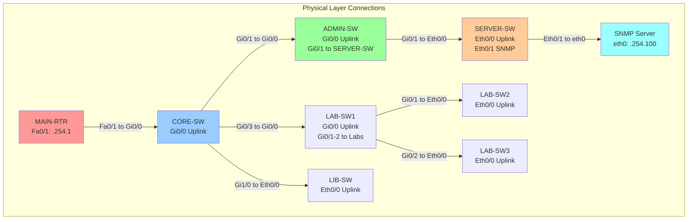
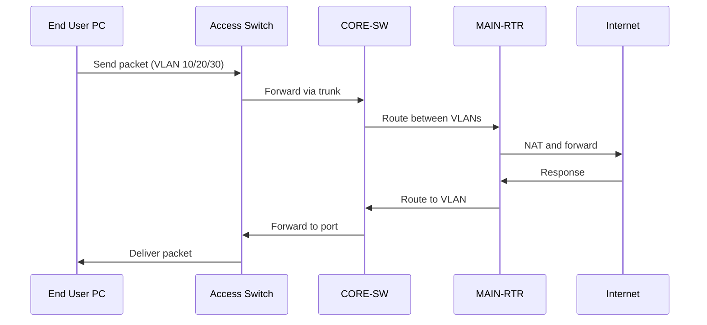
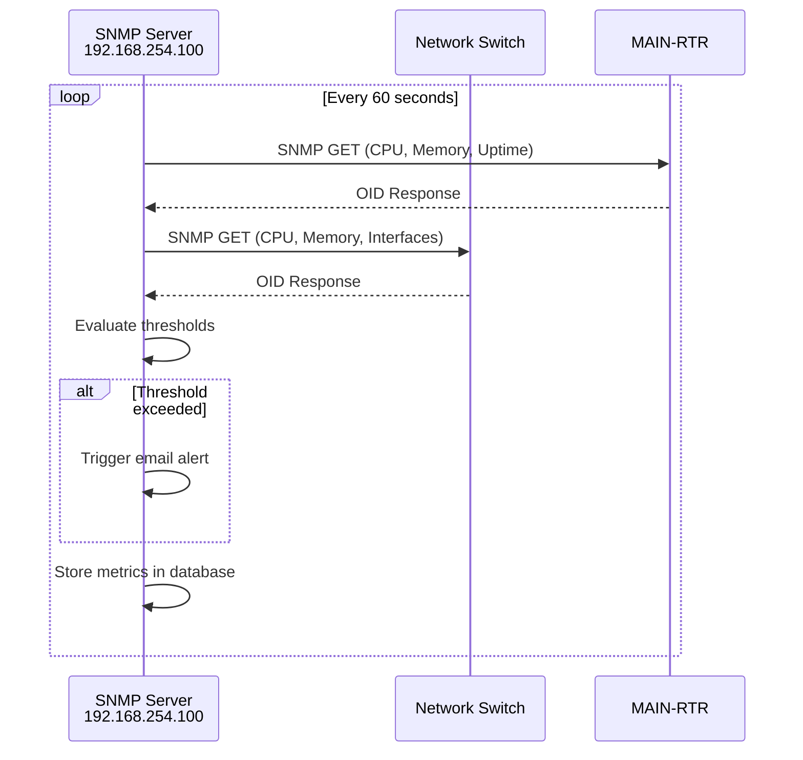
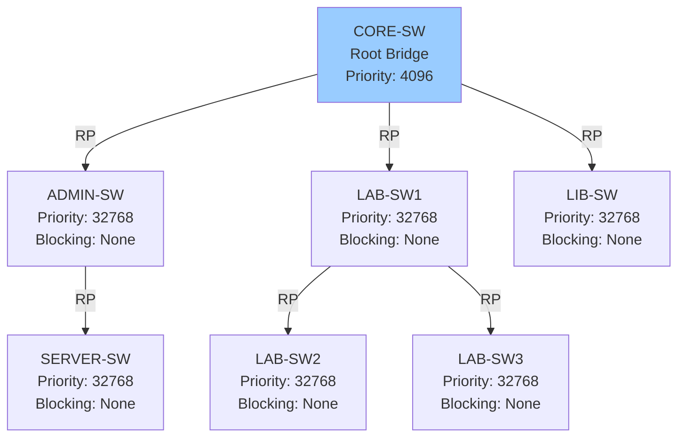

# Network Topology - Detailed Connection Map

## 🔌 Physical Connections

### Connection Matrix



---

## 📊 Detailed Port Assignments

### MAIN-RTR (Cisco 3725)

| Interface | Type | Connection | IP Address | Description |
|-----------|------|------------|------------|-------------|
| FastEthernet0/0 | WAN | → Internet (ISP) | DHCP | Internet uplink |
| FastEthernet0/1 | LAN | → CORE-SW Gi0/0 | 192.168.254.1/24 | Internal network |

**Configuration:**
```cisco
interface FastEthernet0/0
 description WAN - Internet Connection
 ip address dhcp
 ip nat outside
 duplex auto
 speed auto
 no shutdown

interface FastEthernet0/1
 description LAN - Uplink to CORE-SW
 ip address 192.168.254.1 255.255.255.0
 ip nat inside
 duplex auto
 speed auto
 no shutdown
```

---

### CORE-SW (Cisco IOSvL2)

| Interface | Type | Connection | VLAN/Mode | Description |
|-----------|------|------------|-----------|-------------|
| Gi0/0 | Trunk | → MAIN-RTR Fa0/1 | Trunk (10,20,30,40,99) | Uplink to router |
| Gi0/1 | Trunk | → ADMIN-SW Gi0/0 | Trunk (10,99) | To Admin building |
| Gi0/3 | Trunk | → LAB-SW1 Gi0/0 | Trunk (20,99) | To Lab building |
| Gi1/0 | Trunk | → LIB-SW Eth0/0 | Trunk (30,99) | To Library |
| VLAN 99 | SVI | Management | 192.168.254.10/24 | Management interface |

**Configuration:**
```cisco
interface GigabitEthernet0/0
 description Uplink to MAIN-RTR
 switchport trunk encapsulation dot1q
 switchport mode trunk
 switchport trunk allowed vlan 10,20,30,40,99
 no shutdown

interface GigabitEthernet0/1
 description To ADMIN-SW
 switchport trunk encapsulation dot1q
 switchport mode trunk
 switchport trunk allowed vlan 10,99
 no shutdown

interface GigabitEthernet0/3
 description To LAB-SW1
 switchport trunk encapsulation dot1q
 switchport mode trunk
 switchport trunk allowed vlan 20,99
 no shutdown

interface GigabitEthernet1/0
 description To LIB-SW
 switchport trunk encapsulation dot1q
 switchport mode trunk
 switchport trunk allowed vlan 30,99
 no shutdown

interface Vlan99
 description Management Interface
 ip address 192.168.254.10 255.255.255.0
 no shutdown
```

---

### ADMIN-SW (Cisco IOSvL2)

| Interface | Type | Connection | VLAN/Mode | Description |
|-----------|------|------------|-----------|-------------|
| Gi0/0 | Trunk | → CORE-SW Gi0/1 | Trunk (10,99) | Uplink to core |
| Gi0/1 | Trunk | → SERVER-SW Eth0/0 | Trunk (40,99) | To server switch |
| Gi1/0-3 | Access | Staff computers | Access VLAN 10 | Admin workstations |
| VLAN 99 | SVI | Management | 192.168.254.20/24 | Management interface |

**Configuration:**
```cisco
interface GigabitEthernet0/0
 description Uplink to CORE-SW
 switchport trunk encapsulation dot1q
 switchport mode trunk
 switchport trunk allowed vlan 10,99
 no shutdown

interface GigabitEthernet0/1
 description To SERVER-SW
 switchport trunk encapsulation dot1q
 switchport mode trunk
 switchport trunk allowed vlan 40,99
 no shutdown

interface range GigabitEthernet1/0 - 3
 description Staff Computers
 switchport mode access
 switchport access vlan 10
 spanning-tree portfast
 no shutdown

interface Vlan99
 description Management Interface
 ip address 192.168.254.20 255.255.255.0
 no shutdown
```

---

### SERVER-SW (Cisco IOSvL2)

| Interface | Type | Connection | VLAN/Mode | Description |
|-----------|------|------------|-----------|-------------|
| Eth0/0 | Trunk | → ADMIN-SW Gi0/1 | Trunk (40,99) | Uplink to admin switch |
| Eth0/1 | Access | → SNMP Server | Access VLAN 99 | SNMP monitoring server |
| Eth0/2-3 | Access | Servers | Access VLAN 40 | Production servers |
| VLAN 99 | SVI | Management | 192.168.254.25/24 | Management interface |

**Configuration:**
```cisco
interface Ethernet0/0
 description Uplink to ADMIN-SW
 switchport trunk encapsulation dot1q
 switchport mode trunk
 switchport trunk allowed vlan 40,99
 no shutdown

interface Ethernet0/1
 description SNMP Monitoring Server - 192.168.254.100
 switchport mode access
 switchport access vlan 99
 spanning-tree portfast
 no shutdown

interface range Ethernet0/2 - 3
 description Server Connections
 switchport mode access
 switchport access vlan 40
 spanning-tree portfast
 no shutdown

interface Vlan99
 description Management Interface
 ip address 192.168.254.25 255.255.255.0
 no shutdown
```

---

### LAB-SW1 (Cisco IOSvL2)

| Interface | Type | Connection | VLAN/Mode | Description |
|-----------|------|------------|-----------|-------------|
| Gi0/0 | Trunk | → CORE-SW Gi0/3 | Trunk (20,99) | Uplink to core |
| Gi0/1 | Trunk | → LAB-SW2 Eth0/0 | Trunk (20,99) | To Lab 2 switch |
| Gi0/2 | Trunk | → LAB-SW3 Eth0/0 | Trunk (20,99) | To Lab 3 switch |
| Gi1/0-3 | Access | Lab computers | Access VLAN 20 | Student computers |
| VLAN 99 | SVI | Management | 192.168.254.30/24 | Management interface |

**Configuration:**
```cisco
interface GigabitEthernet0/0
 description Uplink to CORE-SW
 switchport trunk encapsulation dot1q
 switchport mode trunk
 switchport trunk allowed vlan 20,99
 no shutdown

interface GigabitEthernet0/1
 description To LAB-SW2
 switchport trunk encapsulation dot1q
 switchport mode trunk
 switchport trunk allowed vlan 20,99
 no shutdown

interface GigabitEthernet0/2
 description To LAB-SW3
 switchport trunk encapsulation dot1q
 switchport mode trunk
 switchport trunk allowed vlan 20,99
 no shutdown

interface range GigabitEthernet1/0 - 3
 description Lab 1 Computers
 switchport mode access
 switchport access vlan 20
 spanning-tree portfast
 no shutdown

interface Vlan99
 description Management Interface
 ip address 192.168.254.30 255.255.255.0
 no shutdown
```

---

### LAB-SW2 (Cisco IOU L2)

| Interface | Type | Connection | VLAN/Mode | Description |
|-----------|------|------------|-----------|-------------|
| Eth0/0 | Trunk | → LAB-SW1 Gi0/1 | Trunk (20,99) | Uplink to LAB-SW1 |
| Eth0/1-3 | Access | Lab computers | Access VLAN 20 | Student computers |
| VLAN 99 | SVI | Management | 192.168.254.31/24 | Management interface |

**Configuration:**
```cisco
interface Ethernet0/0
 description Uplink to LAB-SW1
 switchport trunk encapsulation dot1q
 switchport mode trunk
 switchport trunk allowed vlan 20,99
 no shutdown

interface range Ethernet0/1 - 3
 description Lab 2 Computers
 switchport mode access
 switchport access vlan 20
 spanning-tree portfast
 no shutdown

interface Vlan99
 description Management Interface
 ip address 192.168.254.31 255.255.255.0
 no shutdown
```

---

### LAB-SW3 (Cisco IOU L2)

| Interface | Type | Connection | VLAN/Mode | Description |
|-----------|------|------------|-----------|-------------|
| Eth0/0 | Trunk | → LAB-SW1 Gi0/2 | Trunk (20,99) | Uplink to LAB-SW1 |
| Eth0/1-3 | Access | Lab computers | Access VLAN 20 | Student computers |
| VLAN 99 | SVI | Management | 192.168.254.32/24 | Management interface |

**Configuration:**
```cisco
interface Ethernet0/0
 description Uplink to LAB-SW1
 switchport trunk encapsulation dot1q
 switchport mode trunk
 switchport trunk allowed vlan 20,99
 no shutdown

interface range Ethernet0/1 - 3
 description Lab 3 Computers
 switchport mode access
 switchport access vlan 20
 spanning-tree portfast
 no shutdown

interface Vlan99
 description Management Interface
 ip address 192.168.254.32 255.255.255.0
 no shutdown
```

---

### LIB-SW (Cisco IOU L2)

| Interface | Type | Connection | VLAN/Mode | Description |
|-----------|------|------------|-----------|-------------|
| Eth0/0 | Trunk | → CORE-SW Gi1/0 | Trunk (30,99) | Uplink to core |
| Eth0/1-3 | Access | Library PCs | Access VLAN 30 | Public computers |
| VLAN 99 | SVI | Management | 192.168.254.40/24 | Management interface |

**Configuration:**
```cisco
interface Ethernet0/0
 description Uplink to CORE-SW
 switchport trunk encapsulation dot1q
 switchport mode trunk
 switchport trunk allowed vlan 30,99
 no shutdown

interface range Ethernet0/1 - 3
 description Library Public Computers
 switchport mode access
 switchport access vlan 30
 spanning-tree portfast
 no shutdown

interface Vlan99
 description Management Interface
 ip address 192.168.254.40 255.255.255.0
 no shutdown
```

---

## 🔄 Data Flow Diagram

### User Traffic Flow



### SNMP Monitoring Flow



---

## 🌐 Cable Schedule

| From Device | From Port | Cable Type | To Device | To Port | Length | Notes |
|-------------|-----------|------------|-----------|---------|--------|-------|
| MAIN-RTR | Fa0/1 | CAT6 | CORE-SW | Gi0/0 | 3 ft | Same rack |
| CORE-SW | Gi0/1 | CAT6 | ADMIN-SW | Gi0/0 | 150 ft | Building A |
| CORE-SW | Gi0/3 | CAT6 | LAB-SW1 | Gi0/0 | 200 ft | Building B |
| CORE-SW | Gi1/0 | CAT6 | LIB-SW | Eth0/0 | 250 ft | Building C |
| ADMIN-SW | Gi0/1 | CAT6 | SERVER-SW | Eth0/0 | 6 ft | Same room |
| LAB-SW1 | Gi0/1 | CAT6 | LAB-SW2 | Eth0/0 | 50 ft | Same building |
| LAB-SW1 | Gi0/2 | CAT6 | LAB-SW3 | Eth0/0 | 75 ft | Same building |
| SERVER-SW | Eth0/1 | CAT6 | SNMP Server | eth0 | 3 ft | Same rack |

**Total Cable Required:** ~750 ft CAT6 + 20% spare = 900 ft

---

## 📍 IP Address Summary

| Network | VLAN | Purpose | Gateway | DHCP Pool | Devices |
|---------|------|---------|---------|-----------|---------|
| 192.168.10.0/24 | 10 | Admin Staff | .10.1 | .10.50-.10.200 | 50-80 |
| 192.168.20.0/24 | 20 | Student Labs | .20.1 | .20.50-.20.250 | 100-150 |
| 192.168.30.0/24 | 30 | Library | .30.1 | .30.50-.30.100 | 20-30 |
| 192.168.40.0/24 | 40 | Servers | .40.1 | Static only | 10-15 |
| 192.168.254.0/24 | 99 | Management | .254.1 | Static only | 9 devices |

---

## 🔧 Spanning Tree Topology



**Configuration on CORE-SW:**
```cisco
spanning-tree mode rapid-pvst
spanning-tree extend system-id
spanning-tree vlan 1-4094 priority 4096
```

---

This topology provides a realistic small educational institution network with proper hierarchy, redundancy considerations, and SNMP monitoring capabilities.
