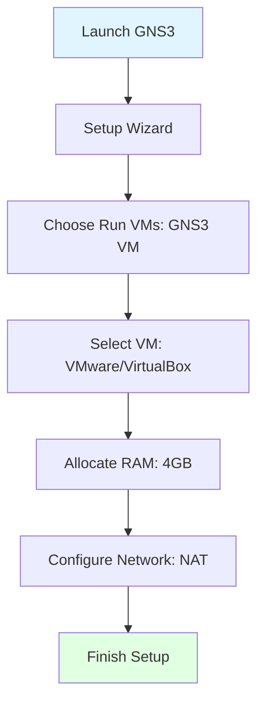
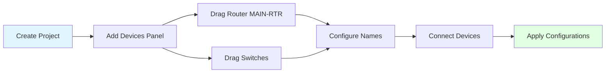
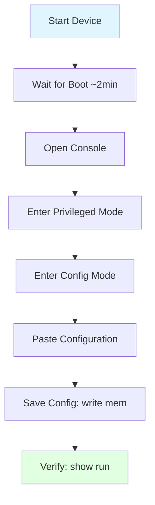

# GNS3 Setup Guide - Step by Step

## 📋 Prerequisites

### Software Requirements
- **GNS3:** Version 2.2.x or later
- **GNS3 VM:** (if using Windows/macOS) with 4GB RAM allocated
- **Operating System:** Windows 10/11, Ubuntu 20.04+, or macOS 11+

### Cisco IOS Images Required

| Device Type | Image Name | Size | Notes |
|-------------|------------|------|-------|
| Router | `c3725-adventerprisek9-mz.124-15.T14.bin` | ~60 MB | Cisco 3725 IOS |
| L2 Switch | `vios_l2-adventerprisek9-m.ssa.high_iron_20200929.qcow2` | ~500 MB | IOSvL2 QCOW2 |
| L2 Switch | `i86bi_linux_l2-adventerprisek9-ms` | ~50 MB | IOU L2 binary |

**Note:** These images must be obtained legally through Cisco VIRL, CML, or educational programs.

---

## 🚀 Step 1: Install GNS3

### Windows Installation

```powershell
# Download GNS3 from https://www.gns3.com/software/download
# Run the installer
# Choose "Install GNS3 VM" when prompted
# Install WinPCAP/Npcap when asked
```

### Linux (Ubuntu) Installation

```bash
# Add GNS3 PPA
sudo add-apt-repository ppa:gns3/ppa
sudo apt update

# Install GNS3
sudo apt install gns3-gui gns3-server

# Add user to required groups
sudo usermod -aG ubridge,libvirt,kvm,wireshark,docker $USER

# Reboot to apply group changes
sudo reboot
```

### macOS Installation

```bash
# Download GNS3 from https://www.gns3.com/software/download
# Install the .dmg file
# Install GNS3 VM using VMware Fusion or VirtualBox
```

---

## 🔧 Step 2: Configure GNS3

### Initial Setup Wizard



### GNS3 Preferences Configuration

1. **Edit → Preferences**
2. **GNS3 VM Settings:**
   - Enable GNS3 VM
   - Allocated RAM: 4096 MB
   - vCPUs: 2-4 cores

3. **Server Settings:**
   - Host binding: 0.0.0.0
   - Port: 3080
   - Enable local server: ✅

---

## 📦 Step 3: Import IOS Images

### Import Cisco 3725 Router

```bash
# In GNS3: Edit → Preferences → Dynamips → IOS routers → New

1. Click "New" button
2. Select IOS image: c3725-adventerprisek9-mz.124-15.T14.bin
3. Router name: "Cisco 3725"
4. Platform: c3725
5. Default RAM: 128 MB
6. Click "Next" through remaining steps
7. Save configuration
```

**CLI Verification:**
```bash
# After importing, verify in GNS3
# The device should appear in left panel under "Routers"
```

### Import IOSvL2 Switch

```bash
# In GNS3: Edit → Preferences → QEMU VMs → New

1. Click "New"
2. Name: "Cisco IOSvL2"
3. Type: Default
4. Select QEMU binary (automatic)
5. RAM: 768 MB
6. Disk image: vios_l2-adventerprisek9-m.ssa.high_iron_20200929.qcow2
7. Network adapters: 8
8. Adapter type: e1000
9. Save configuration
```

**Set as switch:**
```bash
# Edit the IOSvL2 template
# Change category to "Switches"
# Change symbol to switch icon
```

### Import IOU L2 Switch

```bash
# In GNS3: Edit → Preferences → IOS on UNIX → IOU Devices → New

1. Click "New"
2. Server: GNS3 VM
3. Name: "Cisco IOU L2"
4. Path to IOU image: /home/gns3/images/IOU/i86bi_linux_l2-adventerprisek9-ms
5. Type: L2 Image
6. Default RAM: 256 MB
7. Ethernet interfaces: 4
8. Serial interfaces: 0
9. Save configuration
```

---

## 🏗️ Step 4: Create New Project

### Create Project

```bash
# In GNS3 main window

File → New blank project
Project name: "Educational-Institution-Network"
Location: ~/GNS3/projects/
Click OK
```

### Project Workspace Setup



---

## 🔌 Step 5: Build Network Topology

### Add Devices to Workspace

**From Device Panel (left sidebar):**

1. **Add Router:**
   - Drag "Cisco 3725" → workspace
   - Right-click → Change hostname → "MAIN-RTR"

2. **Add IOSvL2 Switches (4 switches):**
   - Drag "Cisco IOSvL2" → workspace (repeat 4 times)
   - Rename to: CORE-SW, ADMIN-SW, SERVER-SW, LAB-SW1

3. **Add IOU L2 Switches (3 switches):**
   - Drag "Cisco IOU L2" → workspace (repeat 3 times)
   - Rename to: LAB-SW2, LAB-SW3, LIB-SW

### Device Placement Layout

```
Workspace Layout (recommended):

[MAIN-RTR]
     |
[CORE-SW]
     |
     +----------+----------+
     |          |          |
[ADMIN-SW] [LAB-SW1]   [LIB-SW]
     |          |
[SERVER-SW]  [LAB-SW2]
             [LAB-SW3]
```

---

## 🔗 Step 6: Connect Devices

### Connection Instructions

**Click the "Add a Link" button (cable icon) then connect:**

| From Device | From Port | To Device | To Port |
|-------------|-----------|-----------|---------|
| MAIN-RTR | FastEthernet0/1 | CORE-SW | GigabitEthernet0/0 |
| CORE-SW | GigabitEthernet0/1 | ADMIN-SW | GigabitEthernet0/0 |
| CORE-SW | GigabitEthernet0/3 | LAB-SW1 | GigabitEthernet0/0 |
| CORE-SW | GigabitEthernet1/0 | LIB-SW | Ethernet0/0 |
| ADMIN-SW | GigabitEthernet0/1 | SERVER-SW | Ethernet0/0 |
| LAB-SW1 | GigabitEthernet0/1 | LAB-SW2 | Ethernet0/0 |
| LAB-SW1 | GigabitEthernet0/2 | LAB-SW3 | Ethernet0/0 |

**CLI Commands to Verify Connections (later):**
```bash
# On any device after boot
show cdp neighbors
show interfaces status
```

---

## 🌐 Step 7: Add Cloud for Internet Access (Optional)

### Connect Router to Internet

```bash
# In GNS3 Device Panel

1. Drag "Cloud" device to workspace
2. Right-click cloud → Configure
3. Select your host's network adapter (Ethernet/WiFi)
4. Click "Add"
5. Connect: Cloud (eth0) → MAIN-RTR (FastEthernet0/0)
```

**This allows:**
- Internet access for router
- DHCP on Fa0/0 interface
- Testing external connectivity

---

## 💾 Step 8: Configure Devices

### Configuration Method 1: Console Access

```bash
# Start all devices (right-click → Start)
# Wait ~2 minutes for boot
# Right-click device → Console
```

**Initial Router Console:**
```
Router> enable
Router# configure terminal
Router(config)# hostname MAIN-RTR

# Copy entire configuration from configs/MAIN-RTR.cfg
# Paste into console
```

### Configuration Method 2: Bulk Import

```bash
# Right-click device → Import config
# Select file: simulation/configs/MAIN-RTR.cfg
# Device will reload with configuration
```

### Configuration Workflow



---

## 📝 Step 9: Apply Configurations to All Devices

### Device-by-Device Configuration

**Router Configuration:**
```bash
# MAIN-RTR
1. Start device
2. Console → MAIN-RTR
3. Type: enable
4. Type: configure terminal
5. Paste entire content from: configs/MAIN-RTR.cfg
6. Type: end
7. Type: write memory
```

**Repeat for All Switches:**

```bash
# Order of configuration (recommended):
1. MAIN-RTR         (configs/MAIN-RTR.cfg)
2. CORE-SW          (configs/CORE-SW.cfg)
3. ADMIN-SW         (configs/ADMIN-SW.cfg)
4. SERVER-SW        (configs/SERVER-SW.cfg)
5. LAB-SW1          (configs/LAB-SW1.cfg)
6. LAB-SW2          (configs/LAB-SW2.cfg)
7. LAB-SW3          (configs/LAB-SW3.cfg)
8. LIB-SW           (configs/LIB-SW.cfg)
```

**Save Configuration on Each Device:**
```bash
# After pasting config
MAIN-RTR# write memory
Building configuration...
[OK]

# Or use shorthand
MAIN-RTR# wr
```

---

## 🧪 Step 10: Verify Network Connectivity

### Test Router to Switch

```bash
# On MAIN-RTR
MAIN-RTR# ping 192.168.254.10
Type escape sequence to abort.
Sending 5, 100-byte ICMP Echos to 192.168.254.10, timeout is 2 seconds:
!!!!!
Success rate is 100 percent (5/5), round-trip min/avg/max = 1/2/4 ms
```

### Test All Management IPs

```bash
# On MAIN-RTR, ping all switches
ping 192.168.254.10   # CORE-SW
ping 192.168.254.20   # ADMIN-SW
ping 192.168.254.25   # SERVER-SW
ping 192.168.254.30   # LAB-SW1
ping 192.168.254.31   # LAB-SW2
ping 192.168.254.32   # LAB-SW3
ping 192.168.254.40   # LIB-SW

# All should return: !!!!!
```

### Verify Spanning Tree

```bash
# On CORE-SW
CORE-SW# show spanning-tree summary
Switch is in rapid-pvst mode
Root bridge for: VLAN0001, VLAN0010, VLAN0020, VLAN0030, VLAN0040, VLAN0099
```

---

## 🖥️ Step 11: Add SNMP Monitoring Server

### Option A: Virtual Machine (Recommended)

```bash
# In GNS3, add Ubuntu VM:
1. File → New template → Manually create new template
2. Select "QEMU VM"
3. Name: "SNMP-Server"
4. RAM: 2048 MB
5. Disk: Ubuntu 22.04 ISO
6. Network adapters: 1
7. Adapter type: e1000
```

**Connect to Network:**
```bash
# Connect: SNMP-Server (eth0) → SERVER-SW (Ethernet0/1)
```

**Ubuntu Network Configuration:**
```bash
# On Ubuntu VM
sudo nano /etc/netplan/01-netcfg.yaml
```

```yaml
network:
  version: 2
  renderer: networkd
  ethernets:
    ens3:
      addresses:
        - 192.168.254.100/24
      routes:
        - to: default
          via: 192.168.254.1
      nameservers:
        addresses:
          - 8.8.8.8
```

```bash
sudo netplan apply
ping 192.168.254.1  # Test connectivity
```

### Option B: Host-Only Network Bridge

```bash
# If using external Ubuntu machine:
1. In GNS3: Add "Cloud" device
2. Configure cloud → Add TAP interface
3. Connect: Cloud (tap0) → SERVER-SW (Ethernet0/1)
4. Configure host machine with IP 192.168.254.100/24
```

---

## 💾 Step 12: Save GNS3 Project

```bash
# In GNS3 main window
File → Save project as...
Name: "Educational-Institution-Network"
Location: ~/GNS3/projects/

# Auto-save is enabled by default
# Project auto-saves every 5 minutes
```

### Export Project (for sharing)

```bash
# File → Export portable project
# Creates .gns3project file
# Includes topology and configurations
# Does NOT include IOS images (copyright)
```

---

## 🔄 Step 13: Start/Stop Network

### Start All Devices

```bash
# Method 1: Right-click workspace → Start all devices

# Method 2: Select all devices
Ctrl+A (or Cmd+A on Mac)
Right-click → Start

# Boot time:
# - Routers: ~90 seconds
# - IOSvL2: ~120 seconds
# - IOU L2: ~30 seconds
```

### Stop All Devices

```bash
# Right-click workspace → Stop all devices
# Or: Select all → Right-click → Stop

# IMPORTANT: Always save configs before stopping!
# On each device: write memory
```

---

## 📊 Resource Monitoring

### Check GNS3 VM Resources

```bash
# In GNS3: GNS3 VM → Show

# Should see:
# - CPU usage: < 80%
# - RAM usage: ~3-4 GB
# - Running devices: 8
```

### Expected Resource Usage

| Component | CPU | RAM | Notes |
|-----------|-----|-----|-------|
| MAIN-RTR (3725) | 5% | 128 MB | Low usage |
| IOSvL2 switches (4x) | 10% each | 768 MB each | ~3 GB total |
| IOU L2 switches (3x) | 2% each | 256 MB each | ~768 MB total |
| **Total** | **~50%** | **~4.2 GB** | Plus GNS3 overhead |

**Minimum Host Requirements:**
- 8 GB RAM
- Quad-core CPU
- 50 GB free disk space

---

## ✅ Verification Checklist

After setup, verify:

- [ ] All 8 devices boot successfully
- [ ] All devices have correct hostnames
- [ ] All management IPs are reachable (192.168.254.x)
- [ ] Trunk links show up/up status
- [ ] Spanning tree root is CORE-SW
- [ ] SNMP community "public" is configured
- [ ] Router has internet access (if cloud connected)
- [ ] SNMP server can ping all devices
- [ ] Configurations are saved (write memory)

---

## 🔧 Troubleshooting

### Device Won't Boot

```bash
# Check RAM allocation
Right-click device → Configure → RAM
# Router: minimum 128 MB
# IOSvL2: minimum 768 MB
# IOU L2: minimum 256 MB
```

### Console Won't Open

```bash
# Check if device is started
# Green indicator should be visible on device
# Right-click → Start if red

# If still fails, close and reopen console
```

### Interfaces Stay Down

```bash
# On device console
Router(config)# interface FastEthernet0/1
Router(config-if)# no shutdown
Router(config-if)# end
Router# show ip interface brief
```

### High CPU Usage

```bash
# Reduce number of running devices
# Stop unused devices
# Allocate more RAM to GNS3 VM
```

---

## 📚 Next Steps

After GNS3 setup is complete:

1. **Configure SNMP Server** → See [03-snmp-server-setup.md](03-snmp-server-setup.md)
2. **Test Connectivity** → See [testing/connectivity-tests.md](../testing/connectivity-tests.md)
3. **Verify SNMP** → See [testing/snmp-verification.md](../testing/snmp-verification.md)

---

**Setup Complete!** 🎉

Your GNS3 educational institution network simulation is now ready for SNMP monitoring.
